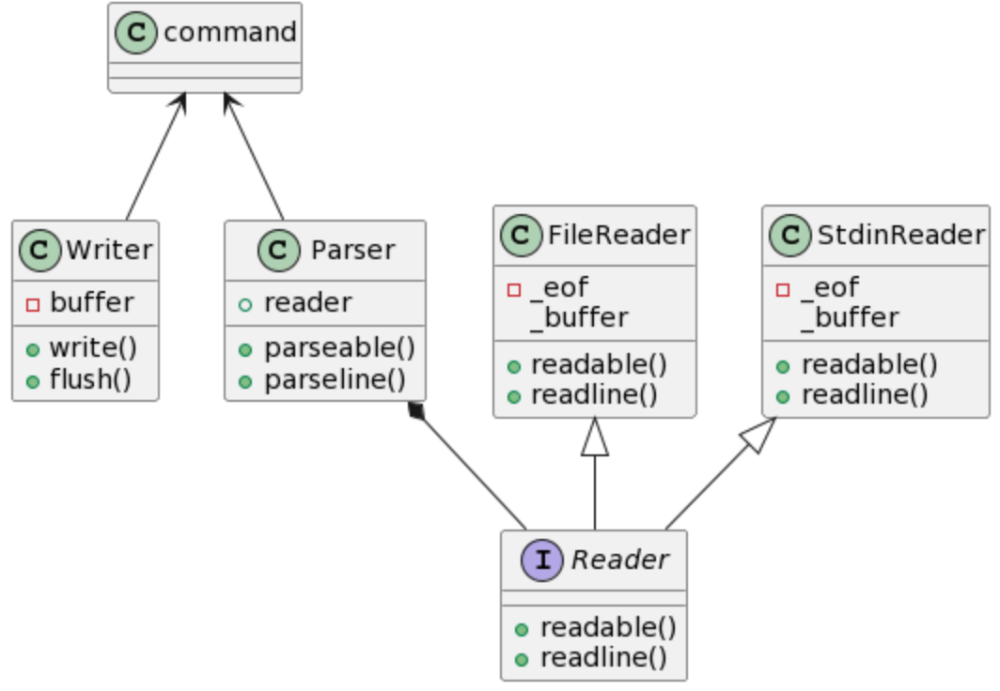

# compilecmds
> 实现一个命令行工具，功能类似 `compiledb`, 以生成 compile_commands.json。

功能上是 `compiledb` 的补充，由于笔者使用 `compiledb` 发现有些不尽如人意的地方

- 无法对使用 `shell` 脚本封装 `make` 进行编译的工程完美解析，生成的 `json` 文件只有一部分，而不是完整的解析所有编译命令。

- 另外如果 `makefile` 嵌套深度稍大，适配度也不是很好，会出现无法解析的情况

基于此，笔者拟实现一个类似工具，支持以上两种情况的编译环境。

### 需求

- 方便易用，以上情景下能正确生成 `compile_commands.json` 文件

- 支持以管道、文件方式读入 `build` 日志进行解析

### 实现方案

数据流为:

```bash
reader --> parser --> writer 
```

类图如下：



### 安装

本项目使用 `click` 框架生成命令，因此可以用以下方式安装

```bash
python3 -m venv .venv
. .venv/bin/activate
pip install --editable .
```
具体信息可参阅 [click](https://click.palletsprojects.com/en/8.1.x/setuptools/#setuptools-integration) 

### 使用

安装后，使用 `ccjson` 命令输出`compile_commands.json` 文件

1. 管道方式, 一边编译，一边生成

```bash
$(make_script) | ccjson 
```

2. 读取编译日志

```bash
ccjson -p $(build.log)
```


